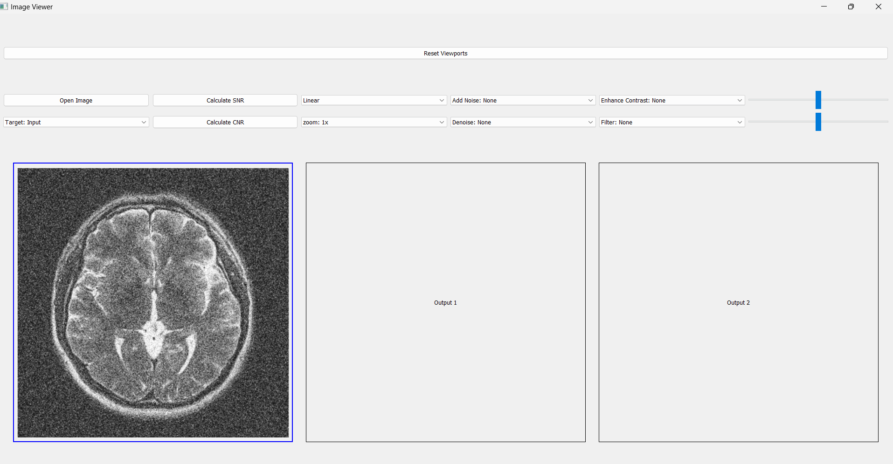
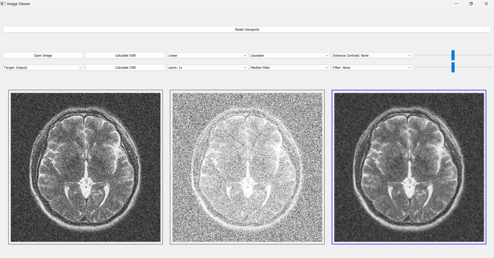
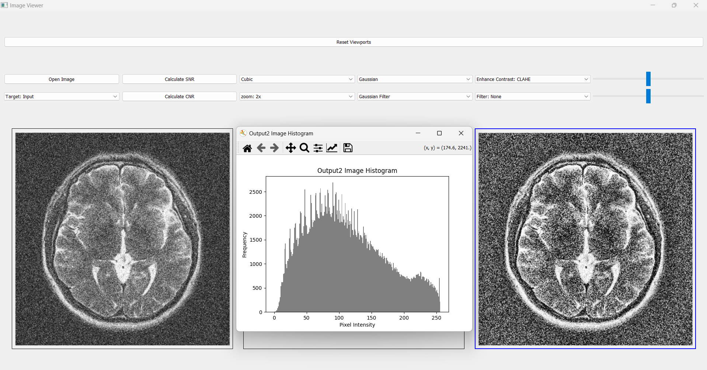
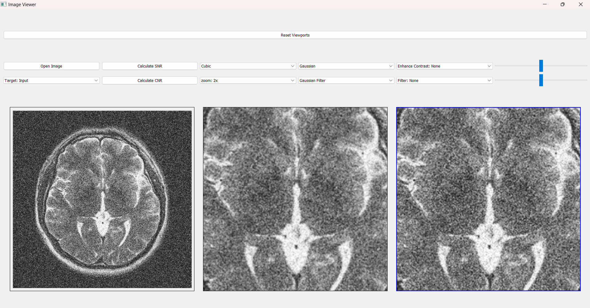
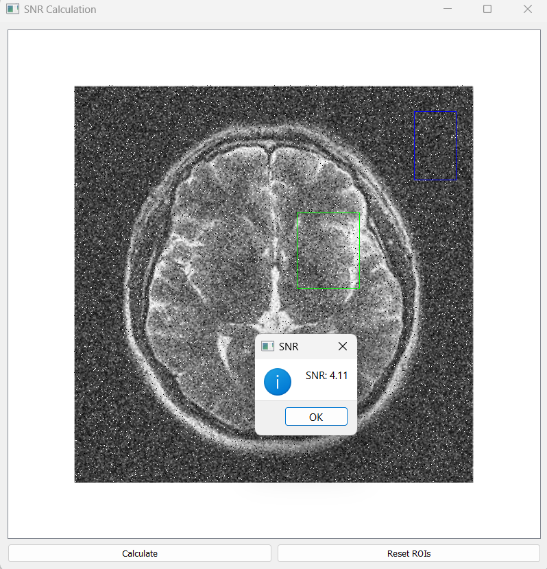
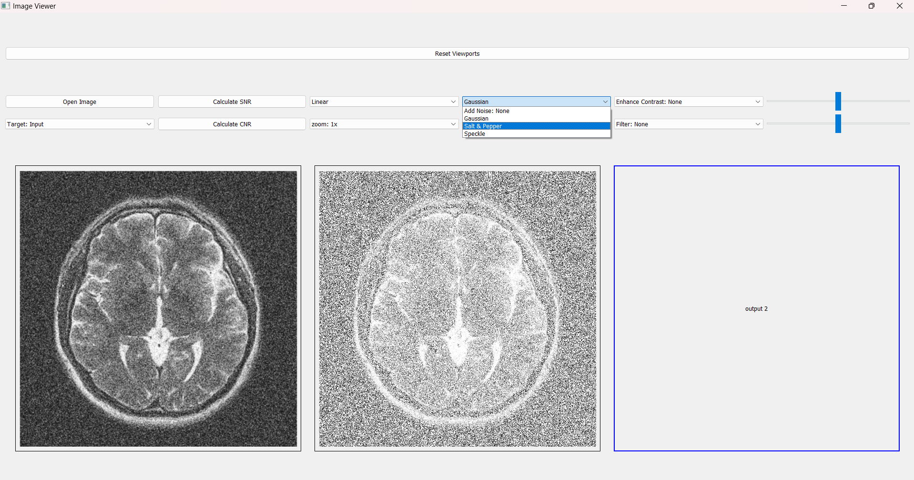
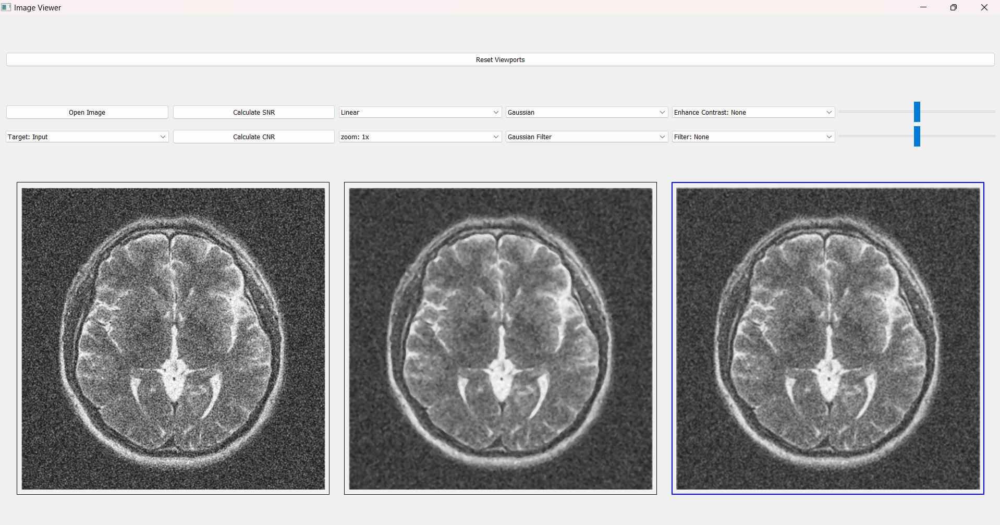
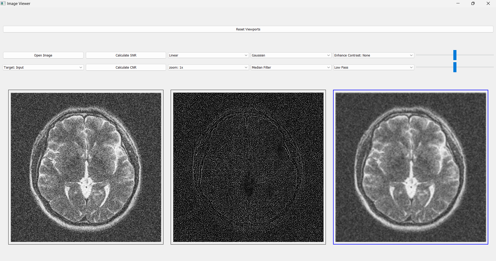
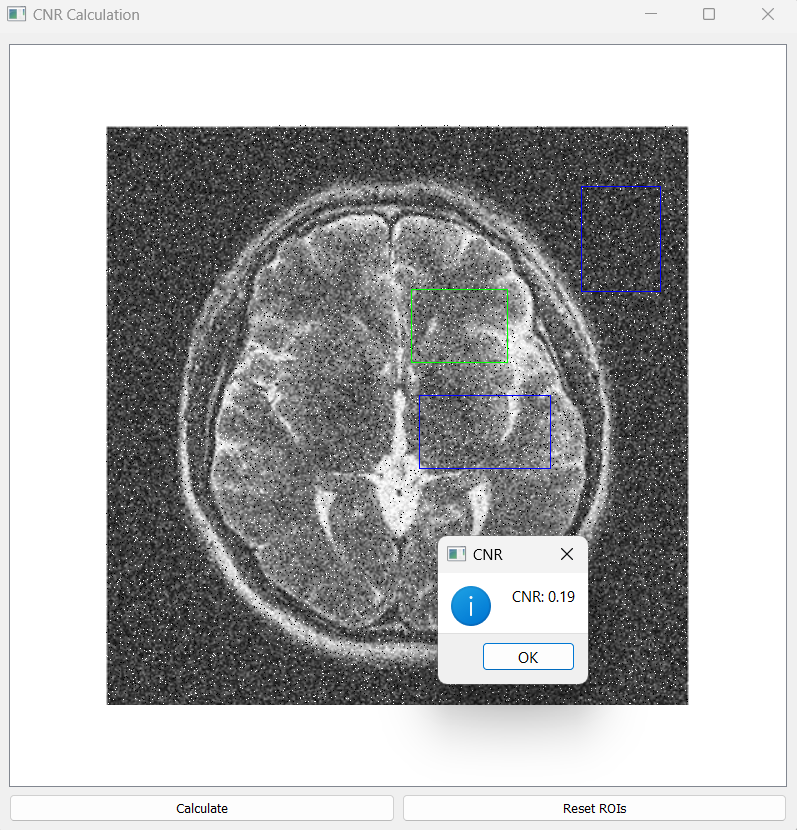
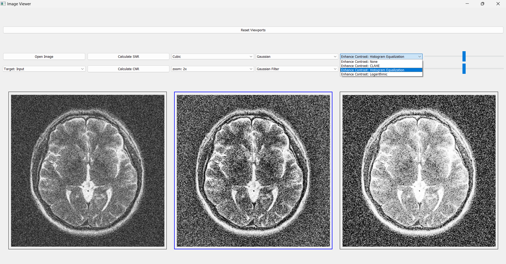

# Image Viewer Project

## Overview
This project is a feature-rich image viewer that allows users to view, edit, and analyze 2D grayscale images. Users can interact with the input image, apply changes, and view results in dedicated output viewports. The application supports advanced functionalities like zooming, noise addition/removal, filtering, and contrast enhancement.

---

## Features

### Core Functionalities
1. **Image Viewing**
   - Load and view a 2D grayscale image in the input viewport.
   - Apply transformations and display results in either of two output viewports.
   
   

2. **Cascading Changes**
   - Apply a change to the input image and display it in Output1.
   - Further modify Output1 and display the new result in Output2.
     
   

3. **Histogram Viewer**
   - View the histogram of any image (input or output) at any time via double-click.
   
   
---

### Editing and Analysis Tools

#### Resolution Adjustment
- **Zoom In/Out**
  - Apply zoom with different scaling factors.
  - Interpolation techniques supported:
    - Nearest-Neighbor
    - Linear
    - Bilinear
    - Cubic

 

#### Signal-to-Noise Ratio (SNR) 
1. **SNR Measurement**
   - Select two ROIs (Regions of Interest) to measure average intensities and compute SNR.
  
 

2. **Noise Addition**
   - Add three different types of noise to the image.
     

3. **Noise Removal**
   - Apply three denoising techniques/filters to enhance the image.
  

#### Filtering
- Apply **Lowpass** and **Highpass** filters to analyze image frequency components.

#### Contrast-to-Noise Ratio (CNR)
-Select 3 ROIs (Regions of Interest) to measure average intensities and standard deviation of noise and compute CNR.

#### Contrast Enhancement 
- Improve CNR using the following methods:
  - Histogram Equalization
  - CLAHE (Contrast Limited Adaptive Histogram Equalization)
  - Logarithmic Method
 

#### Brightness and Contrast
- Adjust brightness and contrast dynamically.

---

## Usage

1. **Load an Image**
   - Open a 2D grayscale image using the file selector.

2. **Perform Edits**
   - Choose from various editing tools to apply changes.
   - Use Output1 for the first edit and Output2 for cascading transformations.

3. **View Histogram**
   - Trigger the histogram viewer for any image by double-clicking (or another specified action).

---

## Requirements

To run this application, install the following Python libraries:

- `numpy`
- `opencv-python`
- `matplotlib`
- `scipy`
- `PyQt5`
  
---

### # Image Viewer Project

## Overview
This project is a feature-rich image viewer that allows users to view, edit, and analyze 2D grayscale images. Users can interact with the input image, apply changes, and view results in dedicated output viewports. The application supports advanced functionalities like zooming, noise addition/removal, filtering, and contrast enhancement.

---

## Features

### Core Functionalities
1. **Image Viewing**
   - Load and view a 2D grayscale image in the input viewport.
   - Apply transformations and display results in either of two output viewports.
   
   

2. **Cascading Changes**
   - Apply a change to the input image and display it in Output1.
   - Further modify Output1 and display the new result in Output2.
     
   

3. **Histogram Viewer**
   - View the histogram of any image (input or output) at any time via double-click.
   
   
---

### Editing and Analysis Tools

#### Resolution Adjustment
- **Zoom In/Out**
  - Apply zoom with different scaling factors.
  - Interpolation techniques supported:
    - Nearest-Neighbor
    - Linear
    - Bilinear
    - Cubic

 

#### Signal-to-Noise Ratio (SNR) 
1. **SNR Measurement**
   - Select two ROIs (Regions of Interest) to measure average intensities and compute SNR.
  
 

2. **Noise Addition**
   - Add three different types of noise to the image.
     

3. **Noise Removal**
   - Apply three denoising techniques/filters to enhance the image.
  

#### Filtering
- Apply **Lowpass** and **Highpass** filters to analyze image frequency components.

#### Contrast-to-Noise Ratio (CNR)
-Select 3 ROIs (Regions of Interest) to measure average intensities and standard deviation of noise and compute CNR.

#### Contrast Enhancement 
- Improve CNR using the following methods:
  - Histogram Equalization
  - CLAHE (Contrast Limited Adaptive Histogram Equalization)
  - Logarithmic Method
 

#### Brightness and Contrast
- Adjust brightness and contrast dynamically.

---

## Usage

1. **Load an Image**
   - Open a 2D grayscale image using the file selector.

2. **Perform Edits**
   - Choose from various editing tools to apply changes.
   - Use Output1 for the first edit and Output2 for cascading transformations.

3. **View Histogram**
   - Trigger the histogram viewer for any image by double-clicking (or another specified action).

---

## Requirements

  Run the following command to install dependencies:
    bash
    
       pip install -r requirements.txt

---

### Acknowledgments

   - OpenCV: For image processing functionality.
   - NumPy: For efficient numerical operations.
   - Matplotlib: For visualization and histogram generation.
   - PyQt5: For creating the interactive GUI.
